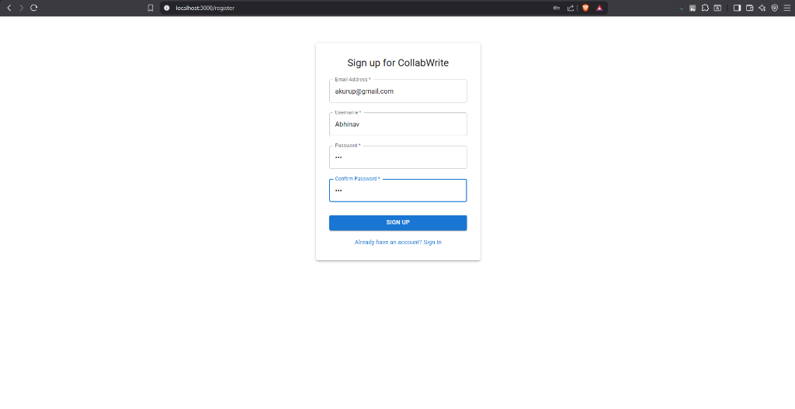
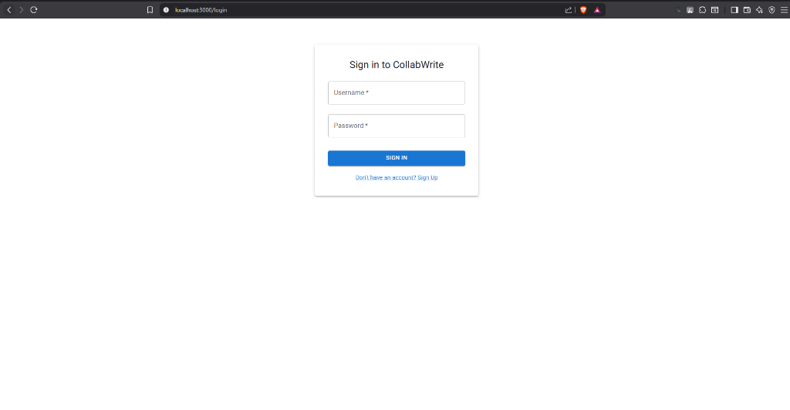
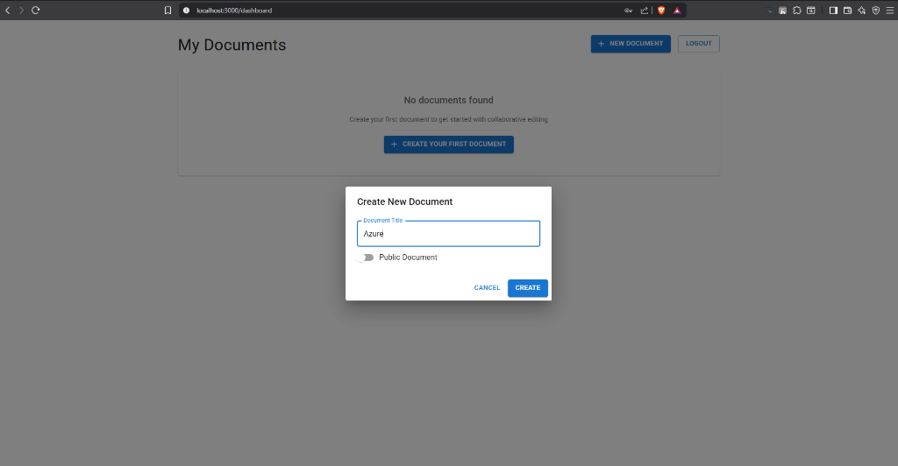
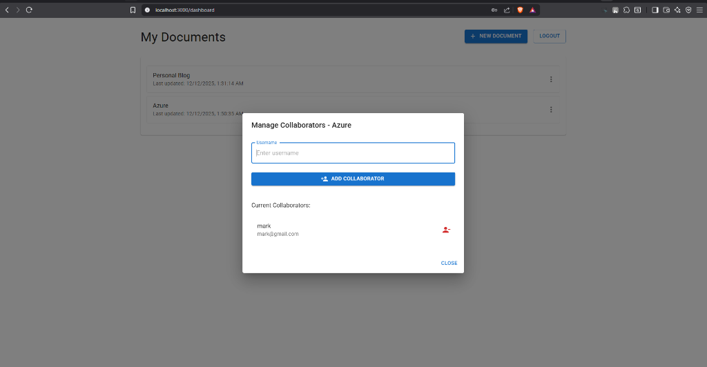
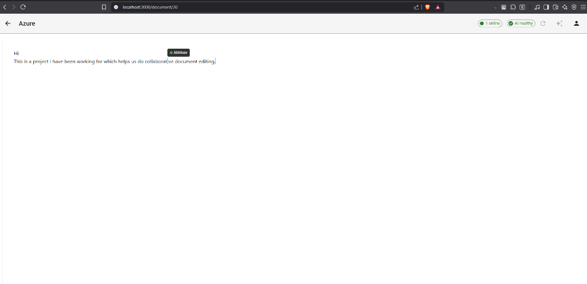
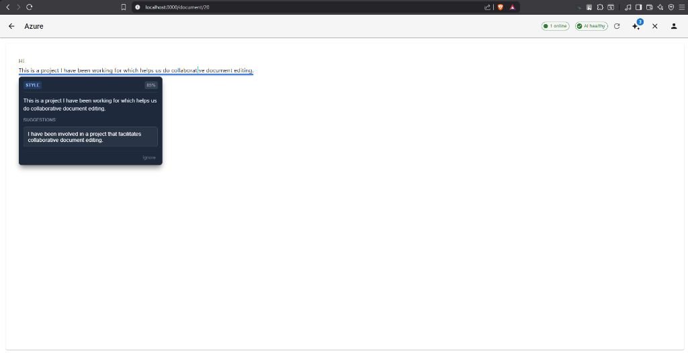
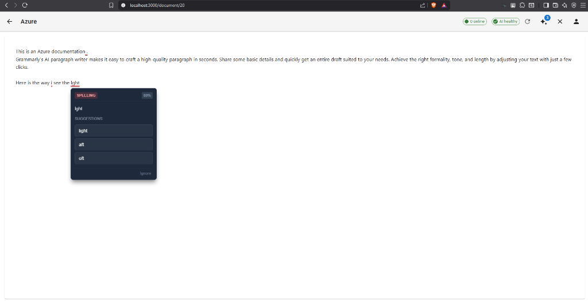

# CollabWrite

CollabWrite is a modern, real-time collaborative document editing platform designed for remote teams, students, and writers. It combines the seamless editing experience of Google Docs with the power of Markdown and AI-driven writing assistance.

## 🚀 Key Features

*   **Real-time Collaboration**: Edit documents simultaneously with multiple users. See changes instantly.
*   **AI Writing Assistant**: Integrated AI tools for grammar checking, style suggestions, and content generation (powered by LanguageTool and Hugging Face models).
*   **Markdown Support**: Write in Markdown with a rich text-like experience.
*   **User Presence**: See who is online and where they are editing in the document.
*   **Secure Authentication**: JWT-based secure signup and login.
*   **Document Management**: Create, organize, and manage your documents in a clear dashboard.

## 📸 Screenshots

| Registration | Dashboard |
|:---:|:---:|
|  |  |
| **Login** | **Create Document** |
|  |  |

### Real-time Collaboration


*Collaborate with team members utilizing real-time cursors and presence indicators.*

### Smart Grammar & Phrase Check
| Style Enhancements | Spelling Corrections |
|:---:|:---:|
|  |  |
| **A.I. Phrase Suggestions** | **Instant Spelling Fixes** |

## 🛠️ Tech Stack

### Backend
*   **Framework**: FastAPI (Python)
*   **Database**: PostgreSQL
*   **ORM**: SQLAlchemy
*   **Real-time**: WebSockets
*   **AI/ML**: Hugging Face Transformers, PyTorch, LanguageTool
*   **Authentication**: JWT

### Frontend
*   **Framework**: React (TypeScript)
*   **UI Library**: Material UI (MUI)
*   **Editor**: Monaco Editor
*   **Collaboration**: Yjs (CRDT for conflict-free editing), y-websocket
*   **State Management**: React Hooks & Context

### Infrastructure
*   **Containerization**: Docker, Docker Compose
*   **Services**: LanguageTool (running in a container)

## 🏁 Getting Started

### Prerequisites
*   [Docker](https://www.docker.com/) and [Docker Compose](https://docs.docker.com/compose/)
*   (Optional) Local PostgreSQL installation if not using a containerized DB (default config points to `host.docker.internal`).

### Installation

1.  **Clone the repository**
    ```bash
    git clone https://github.com/abhinav-kurup/CollabWrite.git
    cd CollabWrite
    ```

2.  **Environment Setup**
    The project uses Docker Compose for easy setup. Ensure your `docker-compose.yml` is configured correctly.
    *   Note: The default configuration expects a PostgreSQL database running on your host machine accessible via `host.docker.internal`. Update `POSTGRES_USER`, `POSTGRES_PASSWORD`, and `POSTGRES_DB` in `docker-compose.yml` or `.env` if needed.

3.  **Run with Docker Compose**
    ```bash
    docker-compose up --build
    ```
    This will start:
    *   **Backend API** at `http://localhost:8000`
    *   **Frontend App** at `http://localhost:3000`
    *   **LanguageTool** service

4.  **Access the Application**
    Open your browser and navigate to `http://localhost:3000`.

## 📚 Documentation

*   **API Documentation**: Available at `http://localhost:8000/docs` (Swagger UI) when the backend is running.

## 🤝 Contributing

Contributions are welcome! Please feel free to submit a Pull Request.

## 📄 License

This project is licensed under the MIT License.